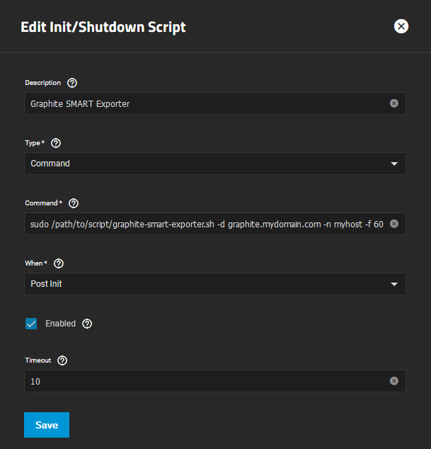

# Graphite S.M.A.R.T. Exporter

_Monitors drive S.M.A.R.T. attributes and periodically sends them to a Graphite compatible server as tagged metrics_

This script was conceived to be an addon to [TrueNAS's](https://www.truenas.com/) own metrics system using [Graphite](https://graphiteapp.org/). The goal of this script was to run out-of-the-box on a TrueNAS SCALE and provide detailed S.M.A.R.T. metrics for all S.M.A.R.T. capable devices in the system.  

It sends plain-text tagged Graphite metrics, which are compatible with the [Prometheus Graphite Exporter](https://github.com/prometheus/graphite_exporter) out-of-the-box. No configuration is necessary in Graphite Exporter, since it supports tagged metrics. To get all of TrueNAS' metrics into Prometheus, Supporterino's [Graphite Mapping File for Prometheus Graphite Exporter](https://github.com/Supporterino/truenas-graphite-to-prometheus) is very helpful.

If a TrueNAS system is already monitored, a Graphite compatible receiver endpoint is available as well, so this script plugs right into that endpoint.

Other solutions to get S.M.A.R.T. metrics from a system exist, such as [smartctl_exporter](https://github.com/prometheus-community/smartctl_exporter) or [prometheus-smartctl](https://github.com/matusnovak/prometheus-smartctl), but these would either need to be run in a privileged container using TrueNAS SCALE's app system (`smartctl_exporter`) or need additional python modules not available on a TrueNAS installation (`prometheus-smartctl`). With TrueNAS being an appliance (and moving to a read-only file system with Dragonfish release), installing python modules is not a viable option.

__Requirements:__
 - [bash](https://www.gnu.org/software/bash/)
 - [smartctl 7.0](https://www.smartmontools.org/)
 - [jq](https://jqlang.github.io/jq/) with oniguruma library (Developed and tested with v1.6, works with v1.5 as well)
 - [netcat](https://nc110.sourceforge.io/)

This script uses `smartctl`'s json output mode, which was introduced with version `7.0`, hence the requirement.  

Even though this script was developed with TrueNAS SCALE in mind, and this documentation mentions use cases related to this scenario in special, it should be able to run on any machine providing the above prerequisites.

Tested on:
  - TrueNAS SCALE 23.10.1
  - Debian 12.4 Bookworm 
  - Synology DSM 7.1 (with manually installed smartctl v7.4 and netcat via [Entware](https://github.com/Entware/Entware))

Might/should work on TrueNAS CORE, test results are welcome!

## Key Features
  - [Run at startup and send metrics with customizable frequency](#set-up-script-to-run-at-truenas-startup-with-custom-frequency)
  - [Tags to make metrics resilient against device name changes after reboots](#exported-metrics-and-tags)
  - [Continue to send last known metrics for devices in STANDBY](#continue-to-send-last-known-metrics-for-devices-in-standby)
  - [Special metrics for device's power state](#exported-metrics-and-tags)
  - [ZFS Support: Provides pool name in info metric](#zfs-support)
  - [Manually specify devices to monitor](#manually-specifying-devices-to-monitor)
  - [Manually specify device types](#manually-specify-device-types)
  - [Logging](#logging)

## Disclaimer

This script was heavily inspired by ngandrass's [TrueNAS Spindown Timer](https://github.com/ngandrass/truenas-spindown-timer). In fact, it was developed to be used in conjunction with the `truenas-spindown-timer` script, since periodic S.M.A.R.T. queries will prevent a device from spinning down on its own. With `truenas-spindown-timer`, drives will still spin down and not be disturbed by this script.  

One of the main motivations for the development of this script was to gather statistics on how often drives are getting spun down and woken up with a specific usage profile to determine whether disk spindown is worth the potential shortening of disk life vs. energy consumption savings.

## Usage
```
Graphite S.M.A.R.T. exporter version 1.1.4
Usage:
  ./graphite_smart_exporter.sh [-h] -d [-p] -n <HOSTNAME> [-f <FREQUENCY>] [-c] [-m <DEVICE>] [-t <DEVICE=TYPE> ] [-v] [-q] [-l <LOG_FILE>] [-s <SMART_TEMP_FILE_NAME>]

Gathers S.M.A.R.T. data about all S.M.A.R.T. capable drives in the system
and sends them as metrics to a Graphite server.

Options:
  -d DESTINATION            : The destnation IP address or host name under which the Graphite
                              server is reachable.
  -p PORT                   : The port the Graphite server is listening on for the plaintext protocol.
  -n HOSTNAME               : The host name to set for the metrics' 'instance' tag.
  -f FREQUENCY              : Frequency metrics are gathered and sent to Graphite with in seconds
                              (default: 300)
  -l LOG_FILE               : Name of the log file to log into. File logging is only enabled if a file name is provided. (default: empty)
  -c                        : Continue sending last known/stale data if a drive is in standby/spun down. If a drive is spun down, S.M.A.R.T. attributes 
                              cannot be read without waking it up. If this option is set, the script continues to send the last known S.M.A.R.T. 
                              metrics for a drive that is spun down to prevent gaps in data.
                              Otherwise no metrics are sent until the drive is awake again.
  -m DEVICE                 : List devices to monitor using this argument, once per drive to minor, e.g. -m /dev/sda -m /dev/sdc
  -t DEVICE=TYPE            : Manually specify the device type for a device. Use this if smartctl device type autodetection does not work for your case. Does NOT disable device discovery. Example: -t /dev/sda=nvme
  -s SMART_TEMP_FILE_NAME   : Name of the temp file the S.M.A.R.T. output is written to during each cycle the script is running.
                              Explicitly set if you plan on running multiple instances of this script to prevent collisions. (default: smart_output.json)
  -o                        : Omit device name tag from info metric. If you're dealing with a system that changes device names frequently, set this flag to avoid multiple time series after the device changed name.
  -q                        : Quiet mode. Outputs are suppressed set. Can not be set if -v is set.
  -v                        : Verbose mode. Prints additional information during execution. File logging is only enabled in verbose mode. Can not be set if -q is set.
  -h                        : Print this help message.
Example usage:
./graphite_smart_exporter.sh -d graphite.mydomain.com -n myhost
./graphite_smart_exporter.sh -d graphite.mydomain.com -p 9198 -n myhost -f 600
./graphite_smart_exporter.sh -d graphite.mydomain.com -n myhost -f 600 -o -m /dev/sda -m /dev/sdc -t /dev/sdc=sat
```

## Set up script to run at TrueNAS startup with custom frequency
To automatically run the script after startup, use TrueNAS' [Init/Shutdown Scripts](https://www.truenas.com/docs/scale/scaleuireference/systemsettings/advancedsettingsscreen/#init/shutdown-scripts-widget) feature.   
Download the script onto your machine. In your TrueNAS UI, navigate to `System Settings -> Advanced -> Init/Shutdown Scripts` and create a new script with the following settings:
 - __Description:__ `Graphite SMART Exporter`
 - __Type:__ `Command`
 - __Command:__ `sudo /path/to/script/graphite_smart_exporter.sh -d graphite.mydomain.com -n myhost -f 60`
 - __When:__ `Post Init`



Since `smartctl` is only available for root, the script must be executed with `sudo`.  ö
The command above will send S.M.A.R.T. metrics to your Graphite instance every 60 seconds.

## Exported Metrics and Tags

At the moment, the script supports metrics for `sat` and `nvme` type of devices.  
(If you need additional device types supported, [open an issue] and append an example output of `smartctl --json=c -a`.)  
See [graphite_export.md](example_data/graphite_export.md) for a sample of this script's exported metrics.

### Metrics
The script will export the following metrics:
| Metric Name                |  Device Types | Description   |
| :--------------------------| :----------- | :------------ |
| `smart_disk_info`          | all          | Info metric with the sole purpose to provide tags to be joined to actual metrics using the serial number; has a static value of `1` |
| `smart_attribute`          | `sat`        | Standard ATA S.M.A.R.T. attribute | 
| `smart_nvme_attribute`     | `nvme`       | NVME S.M.A.R.T Health Information |
| `smart_device_temperature` | all          | Device Temperature in °C |
| `smart_power_cycle_count`  | all          | Number of count of full power on/off cycles |
| `smart_power_on_time_hours`| all          | Number of hours the device has been powered |
| `smart_power_status`       | all          | Indicator whether the device is active or in standby/spun down |
| `smart_status_passed`      | all          | Indicating whether the latest S.M.A.R.T. test has passed |


### Disk Info Tags
The following tags/labels are added to the `smart_disk_info` info metric:
| Tag Name                   | Description   |
| :--------------------------| :------------ |
| `model_name`               | The device's model name (if present), e.g. `HGST_HUH721010ALE600` | 
| `model_family`             | The device's model family (if present), e.g. `HGST_Ultrastar_He10`|
| `serial_number`            | The device's serial number, e.g. `1EHXXXXX`; can be used make sure a certain metric always refers to the same phyiscal device if logical device names change during reboots |
| `firmware_version`         | The firmware version reported by the device, e.g. `LHGNT384`|
| `user_capacity_bytes`      | The drive's capacity in bytes, e.g. `10000831348736` |
| `device_name`              | The shortened logical device name, e.g. `sda`; might change during reboots; not presetn it `-o` argument is set |
| `device_type`              | The device type, e.g. `sat` |
| `instance`                 | The host name passed to the script using `-n` |  
| `zfs_pool`                 | If the disk is part of a ZFS pool, this tag contains the name of that pool |

## Common Tags
All other metrics have the following common tags:
| Tag Name                   | Description   |
| :--------------------------| :------------ |
| `serial_number`            | The device's serial number, e.g. `1EHXXXXX`; can be used to join to `smart_disk_info` metric for additional tags |

### NVME Specific Tags
`smart_nvme_attribute` metrics have these additional tags to the [common tags](#common-tags):
| Tag Name                   | Description   |
| :--------------------------| :------------ |
| `value_type`               | Fixed to `raw` | 
| `attribute_name`           | Name of the reported NVME Health Information, e.g. `available_spare` |

### SAT Specific Tags
`smart_attribute` metrics have these additional tags to the [common tags](#common-tags):
| Tag Name                   | Description   |
| :--------------------------| :------------ |
| `value_type`               | One of `value`, `worst`, `thresh` or `raw` | 
| `attribute_name`           | Name of the reported ATA S.M.A.R.T. attribute, e.g. `Start_Stop_Count` |
| `attribute_id`             | Unique ID of the S.M.A.R.T. attribute, e.g. `4` |


### Limitations for tag values
The [Graphite Documentation on tagged metrics](https://graphite.readthedocs.io/en/latest/tags.html) reads the following about tag values: 
> Tag values must also have a length >= 1, they may contain any ascii characters except  `;` and the first character must not be `~`.

For values that might not always exist (such as `model_name` or `model_family`) that means that the whole tag cannot be added if the value is empty.  
Even though the definition for allowed tag value characters implies that a whitespace is allowed, whitespaces in tag values seem to break some Graphite servers such as the Prometheus Graphite Exporter. This is why this script will replace blanks ` ` in tag values with underscores `_`.

## Omit Device Name from Info Metric
If the device names change between reboots or if devices are added to the system, this will cause multiple time series to be created due to the now differing `device_name` tag. To avoid this, start the script specifying the `-o` flag, which will cause the `device_name` tag to be omitted from the `smart_disk_info` metric.
If `device_name` is volatile, it is of limited value anyway.

## ZFS Support
Since the script was originally designed to be run on a TrueNAS based system, information about ZFS pool assignment for each disk is a logical supplement for the disk's info metrics.
If the script detects ZFS on the system, it will try to find the ZFS pool each monitored disk is assigned to and add a `zfs_pool` tag to the `smart_disk_info` metric. 


## Continue to send last known metrics for devices in STANDBY

If a device is in standby / spun down, querying S.M.A.R.T. attributes would wake it up, which this script will not do. On the other hand this means there are no metrics available for disks that are in standby.  

The script offers the argument `-c`. If that argument is set, it will continue to send the last queried metrics for a device in standby to prevent gaps in the metric time series. The only metric that will be updated is `smart_power_state` (which will reflect the standby state by being `0`).  
⚠️ Be aware that this has the side effect of continuous metrics such as `smart_device_temp` or `smart_power_on_hours` to show sudden jumps in graphs when the updated values are sent after the device has woken up again.


## Manually specify devices to monitor

By default, the script will scan for all S.M.A.R.T. capable device in the system at startup and send metrics for all these devices. If only a specific subset of devices should be monitored, these devices may be passed to the script with the argument `-m`, specifying the argument once per device to monitor.  
The following example will only monitor devices `/dev/sda` and `/dev/sdc` and will not scan for other devices:
```bash
./graphite_smart_exporter.sh -d graphite.mydomain.com -n myhost -m /dev/sda -m /dev/sdc
```

## Manually specify device types

`smartctl` will try to guess the correct device type when querying a specific device. However, it might not get it right for all devices, which might result in wrong/missing output.  
To manually force the script to use a specific device type for a certain device, specify it using the arugment `-t` in the form `<device_name>=<type>`, once per device.  
The following example will only monitor devices `/dev/sda` and `/dev/sdc`, but force `/dev/sdc` to be treated as `sat` type device:
```bash
./graphite_smart_exporter.sh -d graphite.mydomain.com -n myhost -m /dev/sda -m /dev/sdc -t /dev/sdc=sat
```

Note that specifying `-t` alone without `-m` will not disable scanning for devices, but will honor the device type for the specified devices.

## Logging

The script uses `logfmt` as a logging format and supports normal logging to console, logging to a file and no log output at all:
 - pass no additional arguments to only use normal log output on console
 - pass `-v` to enable debug log output
 - pass `-l graphite_smart_exporter.log` to enable logging to the `graphite_smart_exporter.log` file using the specified verbosity level
 - pass `-q` to disable all logging

Note that `-v` and `-q` cannot be set at the same time.

export PATH=/opt/sbin:/opt/bin:$PATH
BASEDIR=$(dirname "$0")
bash $BASEDIR/graphite_smart_exporter.sh -v -d graphite.local.salvoxia.de -p 9109 -n samvault.local.salvoxia.de -s smart_output2.json -f 60 -l graphite_smart_exporter.log -t /dev/sda=sat -t /dev/sdb=sat
